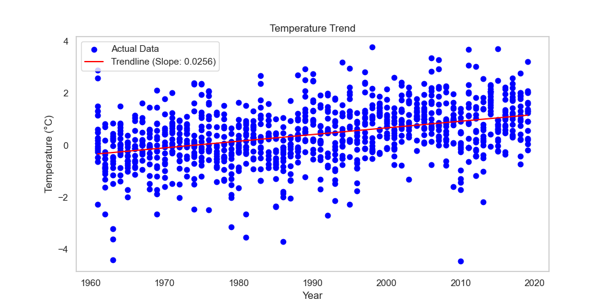

# Global Temperature Trend in the UK  
This project analyzes historical temperature data in the UK and visualizes trends over time.  

## 📈 Trendline Visualization  
The following graph shows the trend in temperature changes:  

  

## 📊 Observations  
- The trendline indicates a rise in average temperatures over time.  
- This suggests increasing warming, likely due to climate change.  

## 🔧 How to Run  
1. Clone the repo  
   ```bash
   git clone https://github.com/yourusername/temperature-trend.git
   cd temperature-trend
